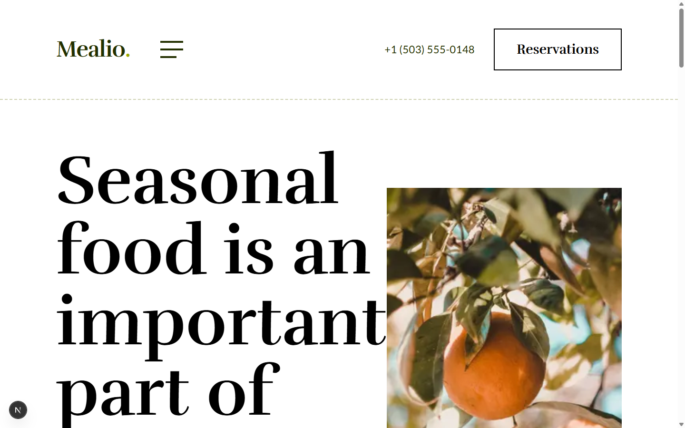
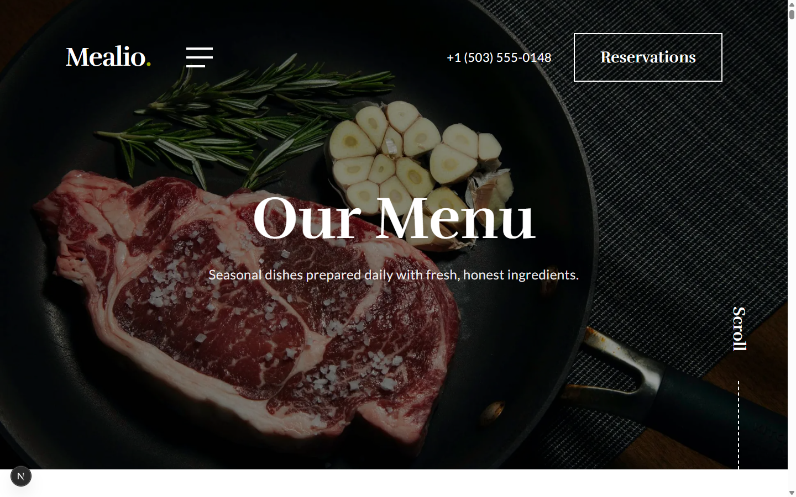
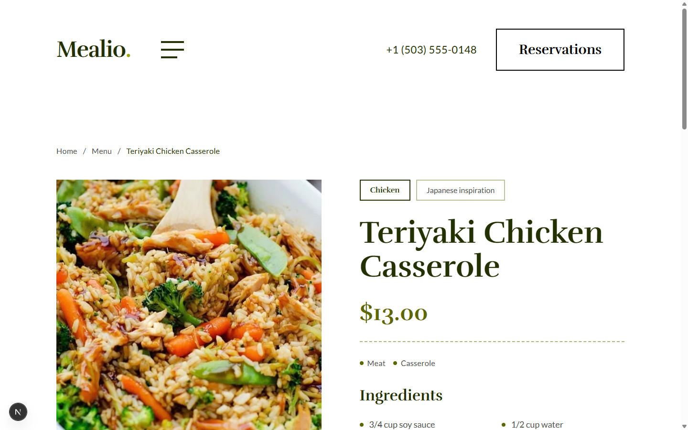
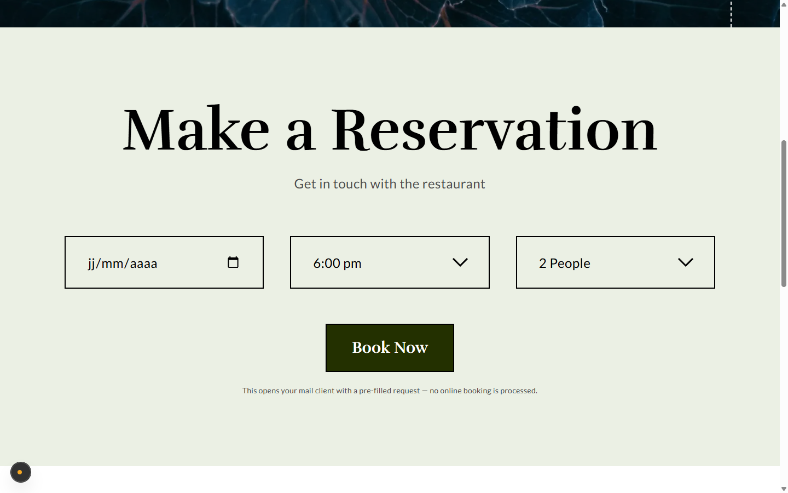
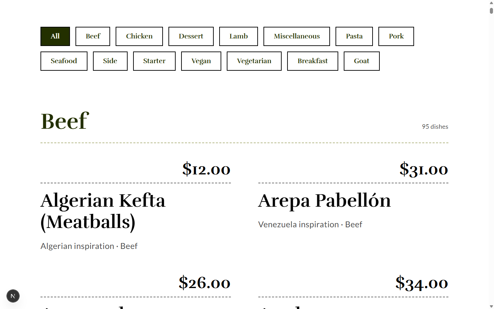
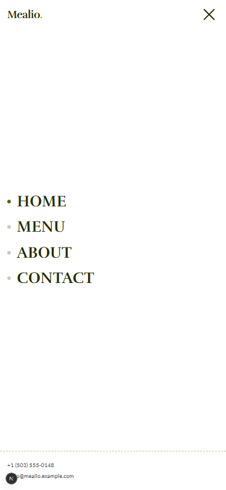
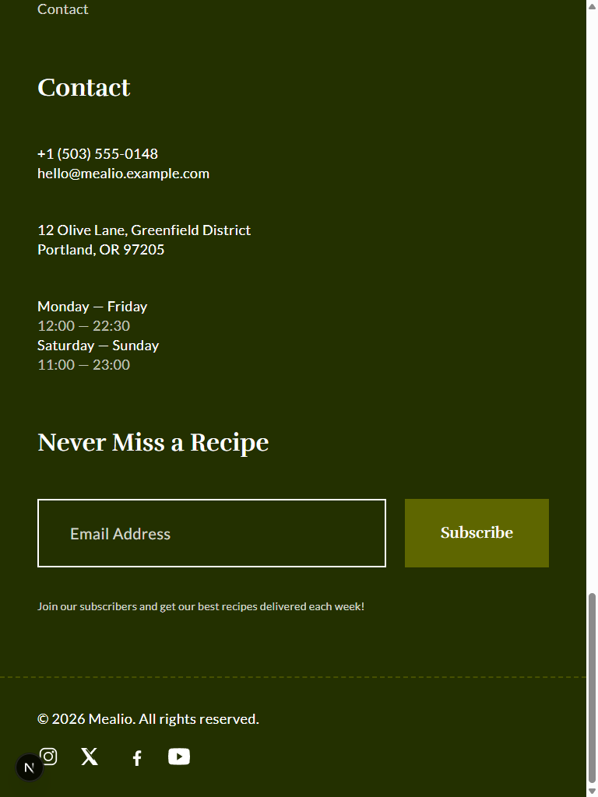

# Mealio

A professional showcase website for a fictional seasonal restaurant. Mealio presents the establishment, its philosophy and its full menu — every dish is loaded live from a public recipe catalog API and rendered inside a faithful, editorial design reproduced from a reference design mockup.

Built as a portfolio project: production-grade structure, strong SEO, accessibility and performance, with a design system translated directly from the source mockup's tokens.



## Features

- **Home** — editorial hero, menu category cards, chef's selection, about teaser and a reservation call to action.
- **Menu** (`/menu`) — the complete menu organized by category, with instant client-side category filtering and editorial price-list rows.
- **Dish detail** (`/menu/[id]`) — photo, category, origin, price, ingredient list with measures and step-by-step preparation.
- **About** (`/about`) — the restaurant's story, values and opening hours.
- **Contact** (`/contact`) — reservation-styled request form (opens a pre-filled email, no booking backend), address, phone and hours.
- **Full-screen navigation** — oversized typographic menu opened from the hamburger button, with keyboard (Escape) support.
- **SEO** — per-page metadata, Open Graph, `sitemap.xml` (including every dish), `robots.txt` and `Restaurant` JSON-LD structured data.
- **Performance** — Server Components by default, `next/image` for every photo, ISR caching of menu data (1 h), self-hosted fonts.
- **Accessibility** — semantic HTML, labelled controls, focus-visible styles, `aria-current`/`aria-pressed`, keyboard-friendly navigation.

## Screenshots

| Home | Menu | Dish | Contact |
|---|---|---|---|
|  |  |  |  |

| Menu sections | Navigation (mobile) | Footer (tablet) |
|---|---|---|
|  |  |  |

## Tech stack

- **Next.js 16** (App Router, Turbopack) · **React 19** · **TypeScript** (strict)
- **Tailwind CSS 4** — all design tokens (colors, typography scale, spacing) are derived from the reference design mockup and centralized in `globals.css`
- **Vitest** — unit tests for the data layer and utilities
- Fonts: **Rufina** (headings) and **Lato** (body), self-hosted via `next/font`

## Data source

Menu content (categories, dish names, photos, origins, ingredients and instructions) comes from a **public recipe catalog API**, configured through an environment variable — the provider is intentionally decoupled from the codebase. Prices are **generated deterministically** from each dish identifier (the API carries no pricing), so every dish always shows the same stable price.

## Getting started

### Prerequisites

- Node.js 20+

### Environment variables

Copy `.env.example` to `.env.local` and fill in the values:

| Variable | Description |
|---|---|
| `MENU_API_BASE_URL` | Base URL of the public menu/recipe API used for menu data (trailing slash required). Ask the maintainer for the endpoint used during development. |
| `NEXT_PUBLIC_SITE_URL` | Canonical site URL used for metadata, sitemap and Open Graph. |

### Run

```bash
npm install
npm run dev        # http://localhost:3000
```

### Quality gates

```bash
npm run lint       # ESLint
npx tsc --noEmit   # TypeScript
npm test           # Vitest unit tests
npm run build      # Production build
```

## Project structure

```
src/
├── app/                    # Routes: /, /menu, /menu/[id], /about, /contact
│   ├── sitemap.ts          # Sitemap incl. every dish URL
│   └── robots.ts
├── components/
│   ├── layout/             # Navbar, full-screen NavMenu, PageHero, Footer, Logo
│   ├── menu/               # CategoryCard, DishCard, PriceListItem, MenuFilter
│   ├── contact/            # ReservationForm (mailto)
│   └── ui/                 # Button, icons
├── lib/
│   ├── api/                # Typed API client + normalizers (getCategories, getMealsByCategory, getMealById, searchMeals)
│   ├── constants.ts        # Site info, nav links, placeholder contact details
│   ├── pricing.ts          # Deterministic price generation
│   └── utils.ts            # cn, slugify, formatPrice
└── types/menu.ts           # Raw API shapes + normalized models
```

## Design

The visual system reproduces a reference restaurant design mockup: a deep forest/olive palette (`#233000`, `#5E6600`, `#9CAA00`, `#EBF0E4`), an editorial serif/sans pairing (Rufina/Lato), oversized display typography, dashed hairline dividers, bordered inputs and buttons, full-bleed photography with dark overlays, and a full-screen typographic navigation. Photos shipped with the mockup are bundled locally under `public/images/`.

## Known limitations

- **No real reservations** — the form opens the visitor's mail client with a pre-filled request; there is intentionally no booking backend, cart, checkout, account or payment system. This is a read-only showcase.
- **Placeholder contact details** — address, phone, email and opening hours are fictional placeholders (see `src/lib/constants.ts`).
- **Menu data provider** — the free public API tier used for menu data is intended for development/portfolio usage; a production deployment would require a licensed tier or a different data source.
- **Derived prices** — prices are deterministic pseudo-values for presentation, not real menu pricing.
- **Newsletter form** — displays a local confirmation only; nothing is transmitted.

## License

MIT — see `LICENSE` if present, otherwise treat as all-rights-reserved portfolio material.

---

Author: Akrem Belkahla
